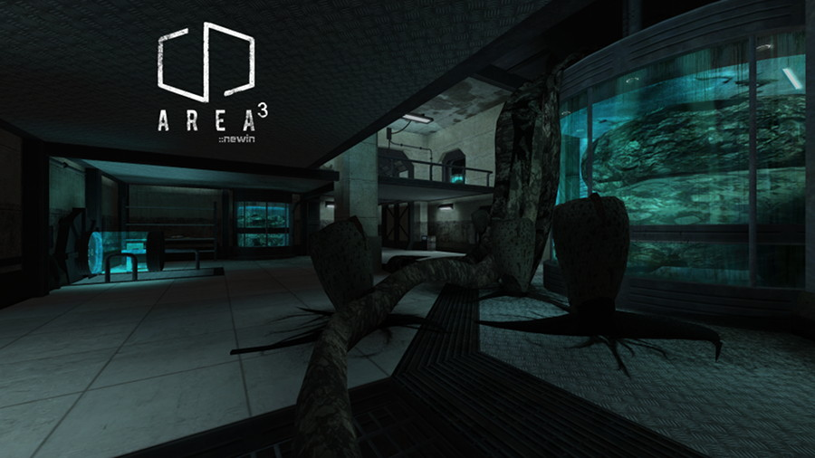

Area³
=====

This is a map designed by Honoré “newin” Jaussoin for the [Urban Terror](http://www.urbanterror.info) game. This project is a port to the [Unvanquished](https://unvanquished.net) game. It features an human laboratory station infestated by a slimy alien form.

This port is an Interstellar Oasis initiative: [https://github.com/InterstellarOasis/InterstellarOasis](https://github.com/InterstellarOasis/InterstellarOasis).

Levelshot
---------

History
-------

* 2018-02-24:	Area³ 0.4 for Unvanquished
* 2011-12-08:	Area³ beta 4 for Urban Terror
* 2011-10-29:	Area³ beta 3 for Urban Terror

Credits
-------

Unvanquished port:

* Thomas “illwieckz” Debesse <dev@illwieckz.net> (http://gg.illwieckz.net)

Mapping:

* Honoré “newin” Jaussoin <big.newin@gmail.com> (http://newincore.tumblr.com/)

Extra credits
-------------

This map uses some models by Black Rayne Studios <blackraynestudios@gmail.com>, textures by CG Textures (https://www.textures.com/) and sounds by Proxima4, Plagasul, ERH and the FreeSound project (https://freesound.org/).
